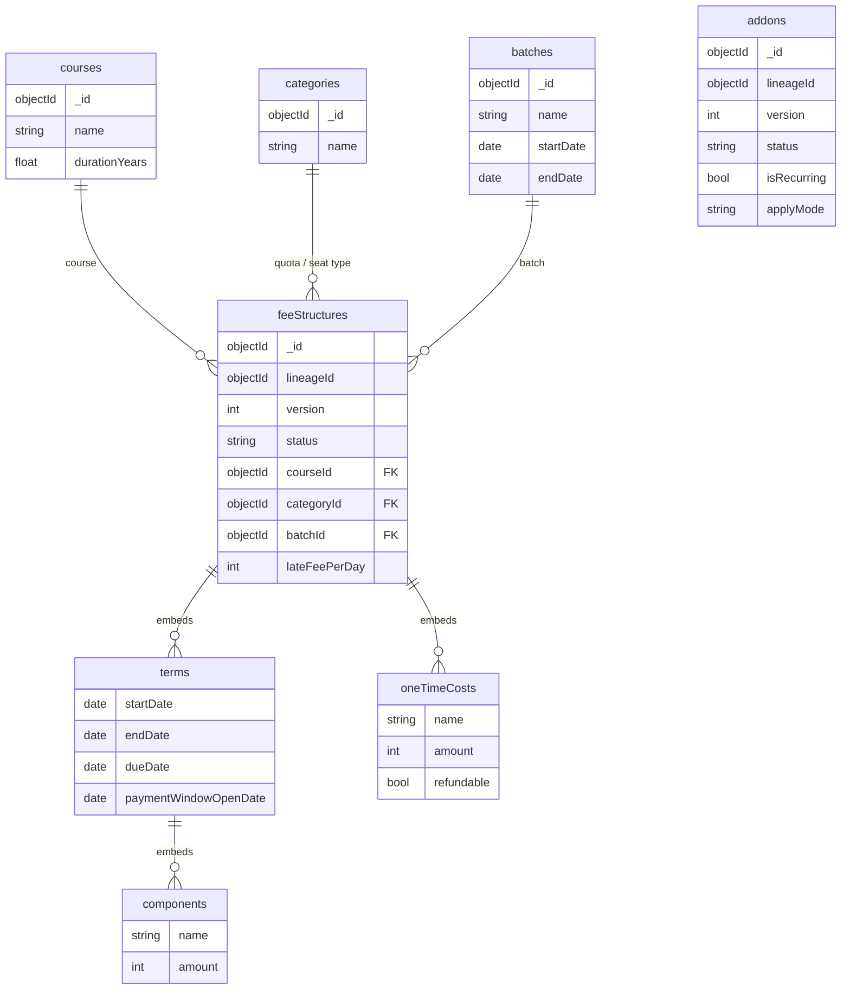

# Fee Catalog — ER Diagram

Fee structures are **per (course, category, batch)**:

- **Course** — the academic program a student enrolls in (MBBS, MD-Radiology, BDS…). Also carries its duration in years.
- **Category** — the **quota / seat type** a student is admitted under (Govt/CET, Management, NRI, OBC, SC/ST, EWS, Institutional…). Determines which fee applies; amounts differ sharply by category (e.g. Govt vs Management can be 20×+ apart).
- **Batch** — the **intake cohort** for a course in an admission year (e.g. "MBBS 2026-27"). A new fee structure is created per batch, and the batch's real start/end dates anchor each term's calendar dates.

## Use cases
The fee catalog is owned by **Finance**. Typical actions:

- **Create a fee structure** for a new batch — define its terms, per-term components, one-time costs (marking refundable ones), and late-fee logic.
- **Clone** last year's structure into a new batch, then bump the amounts for the year-on-year increase.
- **Publish a new version** — revise or correct a structure *before its payment window opens*; the edit becomes the new `ACTIVE` version.
- **Search / browse** fee structures by course, category, or batch.
- **View version history** of a structure (all versions in a lineage).
- **Manage add-ons** — create hostel / food / fine / discount add-ons and publish new versions when their amounts change.

## Data model
Terms, components, and one-time costs are **embedded** inside a `feeStructures` document; courses / categories / batches / addons are separate collections.

