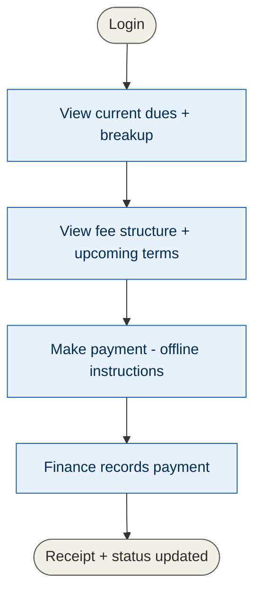
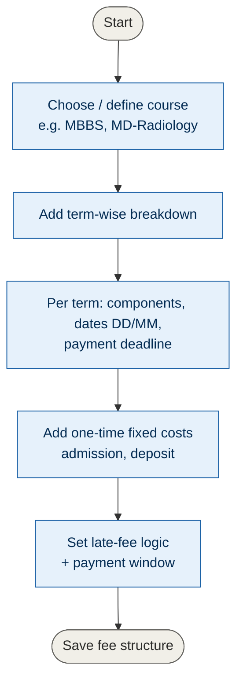
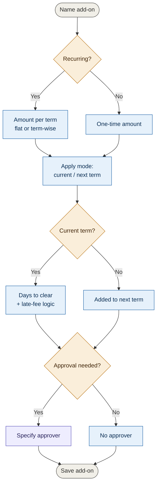
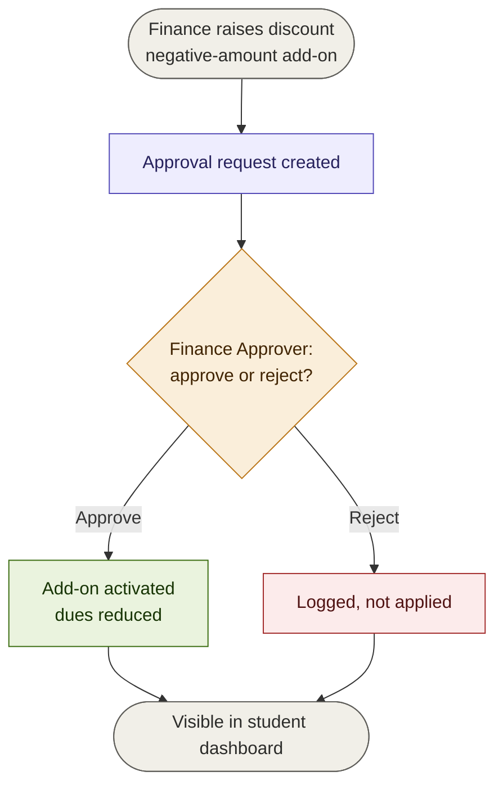
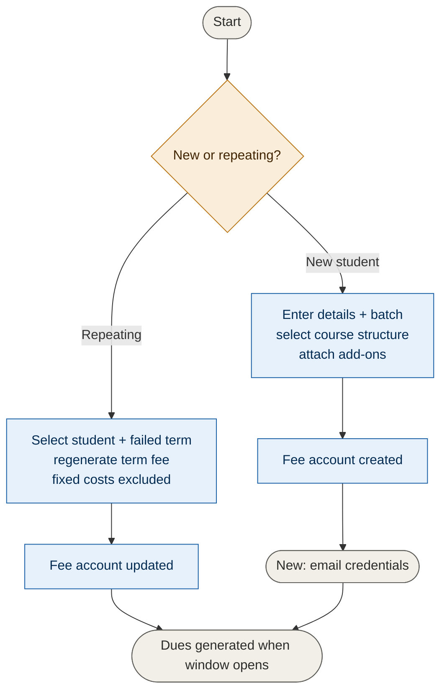
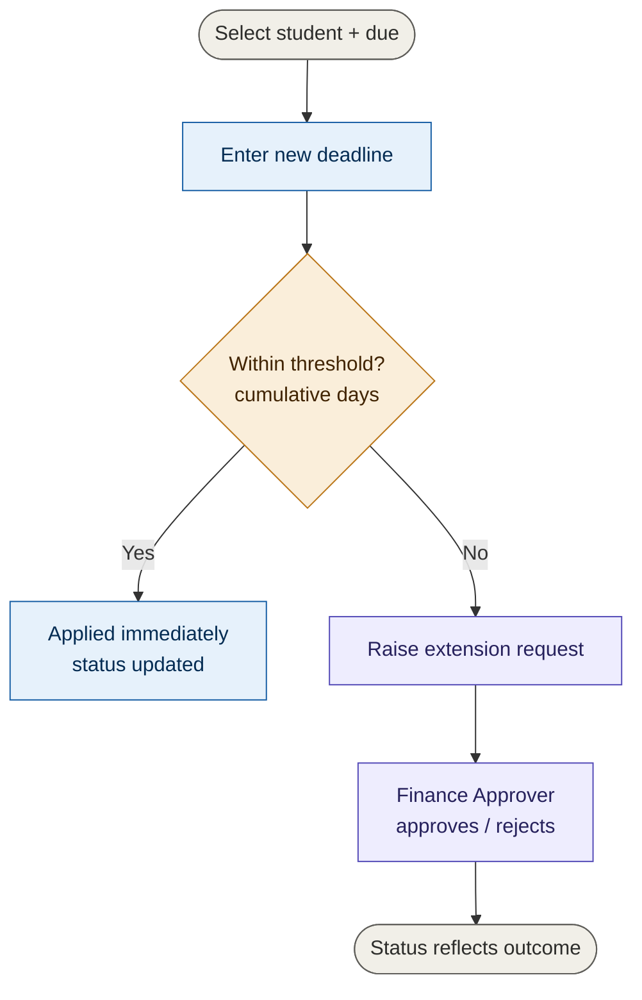
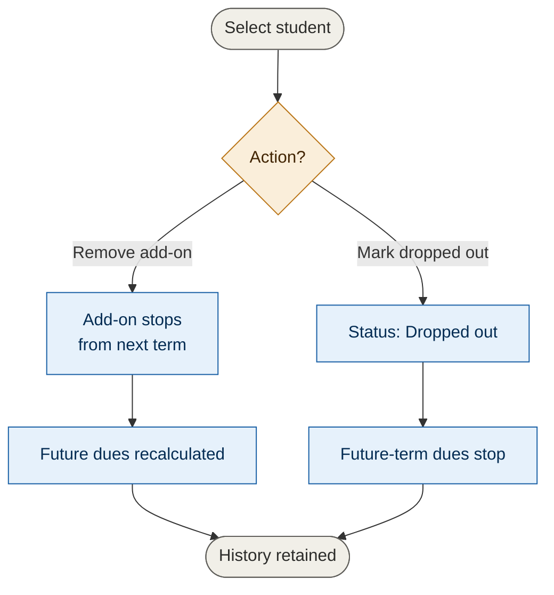
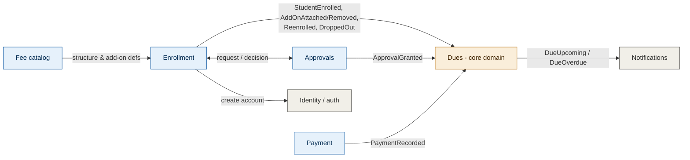

# Fee Portal — Requirements, Journeys & Architecture (MVP)

An application for **fee collection and monitoring** at medical colleges. Four personas — Student, Admin, Finance, Finance Approver — with maker-checker control on anything that changes what a student owes.

> Each flowchart below is color-coded: gray = start/end, blue = process step, amber = decision, purple = finance/approval, green = applied/approved, red = rejected.

---

## 1. Personas

| Persona | Role |
|---|---|
| **Student** | Views own dues, breakup, fee structure, and history. Sees offline payment instructions (online pay is future scope). |
| **Admin** | Operational staff. Creates and enrolls (and re-enrolls) students, attaches fee structures and positive add-ons, applies fines, removes add-ons, extends deadlines up to a threshold, and manages student lifecycle (e.g. marks dropouts). Does **not** handle discounts, define fee structures, or approve anything. |
| **Finance** | Owner of the fee catalog. Creates/edits fee structures and add-ons, records offline payments, runs reports, and **raises** discount/scholarship requests. Does **not** approve them. |
| **Finance Approver** | Approves or rejects discount/scholarship requests (raised by Finance) and beyond-threshold extension requests (raised by Admin). Has read access across students and reports. |

**Guiding principle:** Admin runs operations; Finance owns the money rules; the Finance Approver is the checker. Whoever *raises* a concession never *approves* it.

---

## 2. Domain concepts (shared vocabulary)

- **Fee structure** — a **year-agnostic** template scoped to a single **course** (a college-defined label such as MBBS or MD-Radiology — no fixed program/degree hierarchy, since that varies by college). Contains term-wise fee breakdowns, one-time fixed costs, late-fee logic, and a payment window. Dates are stored as DD/MM; the calendar year is derived from the student's batch.
- **Term** — a billing period within a fee structure, with start/end dates (DD/MM), fee components, and a payment deadline.
- **Fee component** — a line item within a term (tuition, examination fee, lab fee, clinical training fee, etc.).
- **Fixed cost** — a one-time charge (admission/registration, deposit), billed once at first enrollment, not per term.
- **Add-on** — a reusable attachable item with an amount. A positive amount increases dues (hostel, food, fines); a **negative amount** decreases them (discounts, scholarships). Each carries: recurring flag, amount (a number now — percentage-based discounts are future), apply mode (current/next term), days-to-clear + late-fee logic (if current term), an approval-needed flag, and the approver where required. Recurring add-ons last as long as the fee structure they're attached to; **removing** an add-on stops it from the next term onward.
- **Student record** — basic information (name, roll no, course, **batch** e.g. `2022–2026`) plus a **lifecycle status**: `Active`, `Repeating`, `Dropped out`, or `Graduated`. The batch resolves term dates to real calendar dates.
- **Student fee account** — the per-student instance derived from an assigned fee structure + attached add-ons, tracking dues, payments, status, and approval history.
- **Approval request** — a single object the Finance Approver decides: a discount/scholarship (raised by Finance) or a beyond-threshold extension (raised by Admin). Carries type, requester, approver, decision, and audit trail.

---

## 3. Functional requirements by persona

### 3.1 Student
1. View current dues — amount, due date, payment status, itemized breakup.
2. View fee structure and upcoming term dues.
3. Make a fee payment — *online integration is future scope;* MVP shows offline instructions/reference. Confirmed once Finance records it.
4. View transaction history — date, amount, downloadable receipt, breakup (tuition, hostel, travel, food, discounts/scholarships).
5. View basic info — name, course, roll no, batch.

### 3.2 Admin
1. **Create and enroll / re-enroll** a student. New students are created against a course fee structure with batch and positive add-ons, and emailed login credentials. Re-enrollment regenerates a failed term's fee (see §7.5).
2. View an individual student — basic info, payment history, current/upcoming dues, approval status, lifecycle status.
3. View / search / filter all students — by dues, by fee structure, by course.
4. Apply fines — low attendance, library, etc. (positive add-ons, no approval). Request a custom add-on from Finance if none fits.
5. Remove an add-on from a student — takes effect from the next term.
6. Extend a student's fee deadline — up to a configurable threshold; beyond it, Finance Approver approval is required.
7. Manage student lifecycle — mark a student `Dropped out` (or `Graduated`). Students are never deleted; history is retained.
8. Notify students with due fees — *future scope.*

### 3.3 Finance
1. Manage fee structures — view, create, update (course, terms, components, fixed costs, late-fee logic, payment window). Update applies to current or next term — *open question §12.*
2. Manage add-ons — create reusable add-ons (recurring/one-time, amount, apply mode, approval flag, approver).
3. **Raise** discount/scholarship requests — a negative-amount add-on for a student, routed to the Finance Approver.
4. Record offline payments + upload receipts — generates the student-visible receipt and updates dues/status.
5. View student information — same view operations as Admin.
6. Run reports and export CSV — see §10.

### 3.4 Finance Approver
1. View pending approvals — discount/scholarship requests (from Finance) and beyond-threshold extension requests (from Admin).
2. Approve or reject, with an optional note. On approval, a discount activates and reduces the student's dues; an extension updates the due date. Rejection is logged.
3. View approval history — full audit trail (requester, student, type, amount, decision, approver, timestamp).
4. Read access to student information and reports.

---

## 4. Capability matrix

| Capability | Student | Admin | Finance | Finance Approver |
|---|---|---|---|---|
| View own dues / breakup / history / receipt | ✅ | — | — | — |
| Create + enroll / re-enroll students | — | ✅ | ❌ | ❌ |
| Attach positive add-ons / apply fines | — | ✅ | ❌ | ❌ |
| Remove add-ons | — | ✅ | ❌ | ❌ |
| Manage student lifecycle (dropout, etc.) | — | ✅ | ❌ | ❌ |
| Extend deadline — within threshold | — | ✅ | — | — |
| Extend deadline — beyond threshold | — | raise | — | ✅ approve |
| Raise discount/scholarship | — | ❌ | ✅ | ❌ |
| Approve / reject discount + extension | — | ❌ | ❌ | ✅ |
| View / search / filter students | own only | ✅ | ✅ | ✅ |
| Create / edit fee structures | — | ❌ | ✅ | ❌ |
| Create / edit add-ons | — | ❌ | ✅ | ❌ |
| Record offline payment + receipt | — | ❌ | ✅ | ❌ |
| View reports + adjust parameters + CSV | — | ❌ | ✅ | ✅ |

In the MVP both Finance and Finance Approver can view and parameterize the same fixed report catalog — there is no functional difference. The view-only distinction becomes real only with future report *authoring*, where Finance saves custom report definitions and the Approver only views them.

---

## 5. Access control
- The MVP uses **role-based access control (RBAC)**: each persona is a fixed role, and the capability matrix above is the authoritative permission set, enforced server-side. Students are scoped to their own records.
- **Future:** the ability to define **custom roles** from a catalog of granular privileges — for example an "Admin minor" role granting only *View student information* and *Extend deadlines*. This pairs with in-product user management.

---

## 6. Authentication & setup
- **Student accounts are created by Admin** during enrollment (no self-signup). On creation, the system emails the student a username and password.
- For the MVP, a few **Admin, Finance, and Finance Approver accounts** are created directly; there is no self-serve portal for staff accounts.

---

## 7. User journeys

### 7.1 Student

### 7.2 Finance — create a fee structure

### 7.3 Finance — create an add-on
A discount/scholarship is just an add-on with a **negative amount**.

### 7.4 Discount / scholarship — maker-checker
Finance raises; the Finance Approver decides.

### 7.5 Admin — enroll / re-enroll a student
One flow, branching on new vs repeating. Re-enrollment regenerates the failed term's term-wise components plus existing add-ons, and auto-excludes one-time fixed costs.

### 7.6 Admin — extend a deadline (threshold control)

### 7.7 Admin — remove add-on or mark dropout
Students are never deleted — financial history is always retained.

---

## 8. User interfaces

Screens per persona. A single login serves all roles; the role determines the landing page.

### 8.1 Student
- **Dashboard** — current dues, fee breakup, fee structure, and upcoming terms.
- **Payments & receipts** — transaction history, downloadable receipts, and offline payment instructions.

### 8.2 Admin
- **Enroll / re-enroll** — create a new student (details, batch, course structure, add-ons) or re-enroll a failed student.
- **Student information** — search and filter by roll no, name, or batch; open a student.
- **Manage student** — edit info, attach/remove add-ons, re-assign the fee structure, mark lifecycle (dropout/graduate), and view approval status. *(Admin does not author fee structures or add-ons — that is Finance.)*
- **Outstanding dues** — a filterable worklist of students with overdue or upcoming dues (by aging, batch, status); extend deadlines from here.
- **Extensions & requests** — extend deadlines for an individual or a batch of students, and track the status of extension requests. *(Beyond-threshold extensions each route to the Finance Approver, so a batch extension can create many requests.)*
- **Notifications** *(future scope)* — send due reminders to batches of students and nudge the Finance Approver about pending approvals.

### 8.3 Finance
- **Fee structures** — search and manage (create/edit) course-based structures.
- **Add-ons** — manage (create/edit/view) add-ons (hostel, food, fines, discounts).
- **Requests & approvals** — raise discount/scholarship requests; view all requests (from Admin and Finance) and track their status.
- **Outstanding dues** — a filterable worklist of overdue or upcoming dues (by aging, batch, status); record payments against them from here.
- **Record payment** — record an offline payment for a student and upload the receipt.
- **Student information** — search and filter by roll no, name, or batch.
- **Reporting** — view the report catalog, adjust parameters, and export CSV (includes the minimal operational-health view).

### 8.4 Finance Approver
- **Approvals** — view all pending requests (discounts and extensions); approve or reject with a note; view history.
- **Student information** — read-only search and view.
- **Reporting** — view reports, adjust parameters, and export CSV.

---

## 9. Worked examples

### 9a. Fee structure — course: MBBS (year-agnostic; dates as DD/MM)

| | Term 1 | Term 2 |
|---|---|---|
| Start (DD/MM) | 01/08 | 20/01 |
| End (DD/MM) | 31/12 | 15/05 |
| Tuition | 10,000 | 10,000 |
| Examination fee | 2,000 | 2,000 |
| Clinical training fee | 1,000 | 3,000 |
| Payment deadline | 18/08 | 05/02 |

One-time fixed costs (billed once, at first enrollment): admission/registration fee, refundable deposit.
Late-fee logic: charge per day after deadline; payment window opens 30 days before deadline.

A student in batch `2022–2026` has these dates resolved to real years from their batch (Term 1 → Aug 2022, Term 2 → Jan–May 2023, and so on per year of study).

### 9b. Add-ons

| Add-on | Recurring | Amount | Apply mode | Approval? | Approver |
|---|---|---|---|---|---|
| Hostel | yes | Term 1: 10,000 · Term 2: 8,000 | next term | no | — |
| Food | yes | 10,000 / term (flat) | next term | no | — |
| Low attendance fine | no | 500 (clear in 10 days) | current term | no | — |
| Scholarship | no | **−10,000** | next term | yes | Finance Approver |

A discount/scholarship is a negative-amount add-on — no separate type. Amounts are fixed numbers for the MVP; **percentage-based discounts** (e.g. 50% of tuition) are future. Recurring add-ons stay in effect for the life of the fee structure they're attached to; removing one stops it from the next term.

---

## 10. Reports & dashboards

The MVP ships a **fixed catalog** of reports with adjustable parameters (date range, term, batch). Both Finance and Finance Approver can view them and change parameters — there is no functional difference yet. Report *authoring* (saving custom report definitions) is future scope; that is where the Finance-authors / Approver-views distinction would become real.

Collection reporting:

- Collections by term/quarter.
- Receivables in the current term.
- Overdue dues with simple **aging buckets** (0–30 / 30–60 / 60+ days), since how overdue a payment is drives follow-up more than a flat total.
- **On-time payment rate** — percentage of students who paid on or before the due date.
- **Total concessions granted** — revenue forgone to discounts/scholarships in a period.
- **Average days-to-pay** — mean gap between window open and payment.
- CSV export of any of the above.

Operational health (minimal for MVP): whether the daily due-generation job ran and how many errors it produced. The richer operational dashboard (payment-gateway uptime, failed-transaction rates) depends on the gateway and is future scope.

Future KPI — notification effectiveness: once notifications ship, measure whether a notification (and earlier timing) improves the on-time payment rate. The events are designed to make this possible later (notification-sent and payment timestamps are captured), but the analysis itself is Phase 2.

---

## 11. Architecture — Domain-Driven decomposition

This section maps the functionality onto bounded contexts so teams can build and reason about parts independently.

### 11.1 Subdomain classification
- **Core: Dues.** The billing engine — due generation, scheduling, late-fee accrual, status transitions. The real complexity and value live here.
- **Supporting: Fee Catalog, Enrollment, Approvals, Payment** (offline recording for the MVP).
- **Generic: Notifications, Identity/Auth.** Thin wrappers; deferred or bought rather than hand-crafted.

### 11.2 Bounded contexts and aggregates
- **Fee Catalog** — owns `FeeStructure` (root: course, terms, components, fixed costs) and `AddOn` (root). One context, two aggregates; structures and add-ons share the same language and owner.
- **Enrollment** — owns the `Student` aggregate (basic info, batch, lifecycle status, assigned-structure reference, attached add-ons and their status). Entry point; handles search, re-enrollment, add-on removal, dropouts.
- **Dues (core)** — owns a `FeeAccount` aggregate per student (due line items, statuses, extensions, accrued late fees). Runs the daily job that materializes dues when payment windows open and accrues late fees.
- **Approvals** — owns the `ApprovalRequest` aggregate (type, requester, approver, decision, audit trail). Serves discounts and extensions.
- **Payment** — owns `Payment`/`Receipt` records. MVP: Finance records offline payments + uploads receipts; gateway is future.
- **Notifications (generic, deferred)** — subscribes to events, holds contact info, sends messages.
- **Identity/Auth (generic)** — student accounts created at enrollment + emailed credentials; staff accounts seeded.

### 11.3 Context map

### 11.4 Domain events

| Event | Emitted by | Consumed by | Effect |
|---|---|---|---|
| StudentEnrolled | Enrollment | Dues, Identity, Notifications | Dues generates pending dues from structure + add-on snapshots; Identity creates an account; Notifications stores contact info |
| StudentReenrolled | Enrollment | Dues | Regenerate the failed term's dues (components + add-ons, minus fixed costs) |
| StudentAddOnAttached | Enrollment | Dues | Add the add-on's amount to upcoming dues |
| StudentAddOnRemoved | Enrollment | Dues | Stop including the add-on from next term |
| StudentDroppedOut | Enrollment | Dues | Stop materializing future-term dues |
| ApprovalGranted | Approvals | Enrollment / Dues | Discount → Enrollment activates the add-on → dues recalculated; extension → Dues updates the due date |
| ApprovalRejected | Approvals | Enrollment | Mark request rejected; no due change |
| PaymentRecorded | Payment | Dues | Clear the due / reduce balance, update status |
| DueUpcoming / DueOverdue | Dues | Notifications | Trigger reminder (when notifications ship) |

### 11.5 Key design decisions
- **Commands vs events.** Creating an approval is a synchronous command/API call (the requester needs the request ID back); the *decision* (`ApprovalGranted`/`Rejected`) is the event. Reading a student's approvals is a query into Approvals by `studentId`.
- **Enrollment vs Approvals ownership.** Enrollment owns the student's attached add-ons and their `pending`/`active` status; the approval decision flips that status. Approvals owns the workflow and audit trail. Enrollment stores only the `approvalRequestId` and resulting status — enough to know whether to count the add-on.
- **Event-carried state transfer.** Enrollment events carry a *snapshot* of the relevant structure/add-on, not just an ID. Dues needs no synchronous call back to the Catalog, and a student's dues are computed from the structure as it was at enrollment — which is exactly the "edits apply to new assignments only" rule, for free.

---

## 12. Open questions
- **Outstanding dues at dropout** — when a student is marked `Dropped out`, are remaining dues written off, retained as owed, or settled against the refundable deposit? A policy decision for the college.
- **Partial payments** — allow paying part of a due? The component + add-on structure supports it; a likely first fast-follow.
- **Updating fee structures** — apply changes to the current term, or next term only? For the MVP, edits apply to new assignments / next term. Per-student snapshots (so existing students keep the version they were assigned) depend on fee-structure versioning, a future requirement.
- **Approver assignment** — is the Finance Approver any user with that role, or a specific named individual per request? And what happens if they're unavailable?
- **Online payment gateway at launch** — a hard requirement for any partner college's go-live? If yes, it moves into the MVP and reshapes the timeline.

---

## 13. Out of scope / future requirements (v1)
Online payment gateway, partial/installment payments, percentage-based discounts, fee-structure versioning (per-student snapshots), report authoring (custom report definitions), student fee notifications, notification-effectiveness KPI, gateway-dependent operational dashboard, refunds/reversals (incl. deposit refund at course exit), bulk student import, parent/guardian login, custom roles / UI-configurable access control, full audit log of all staff actions, Super Admin / in-product user management, automated bank reconciliation.
